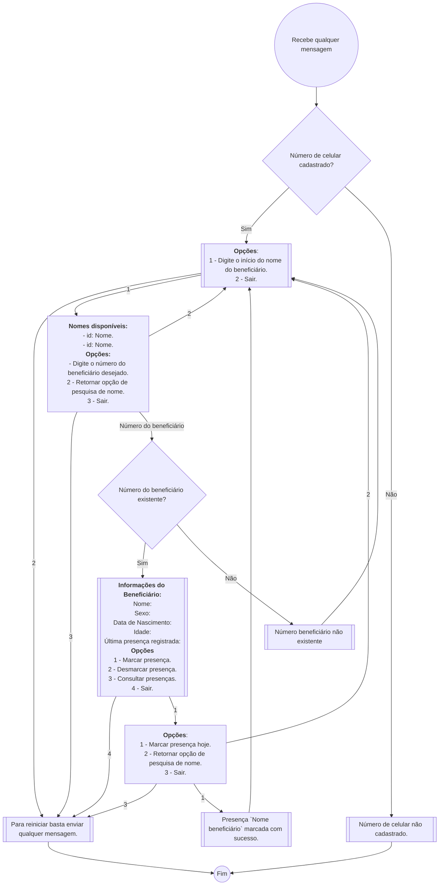

# Pacoa API

API para gestão de beneficiários do [Projeto Social Pacoa](https://www.facebook.com/projetopacoa/?locale=pt_BR).

### Setup

- Clone e instalação dos pacotes necessários

```
git clone git@github.com:gabrielbdornas/pacoa-api.git
cd pacoa-api

# Linux enviroment
python3 -m venv venv
source venv/bin/activate
pip install -r requirements.txt

# Windows enviroment
python -m venv venv
source venv/Script/activate
pip install -r requirements.txt
```

- Migração do bando de dados:

```
flask db init # cria pasta de migração (inicia o processo).
flask db migrate # cria a migração
flask db upgrade # inclui mudanças no banco
```

Por fim, basta executar `task server` para rodar a API localmente.

Obs.: Para realizar queries no banco de dados via terminal interativo Python rodar:

```
$ python
from app import create_app
create_app().app_context().push()
```

### Fluxo registro de presença


